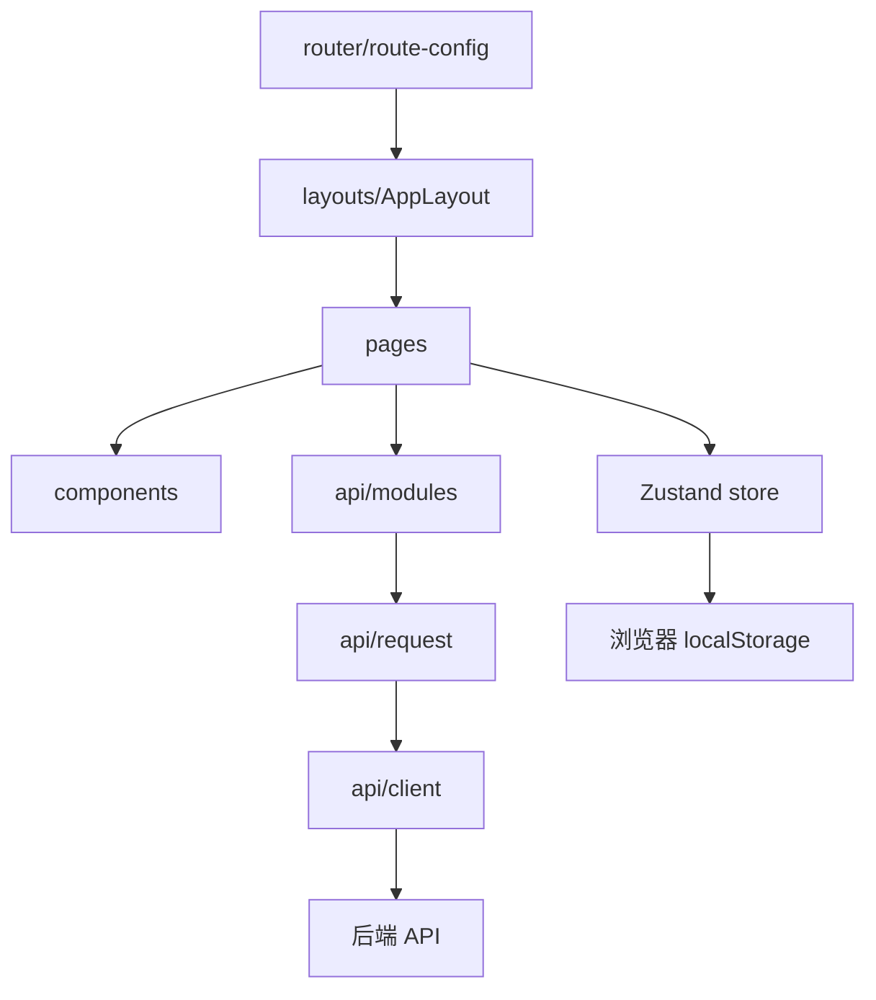

# 智能体记忆管理前端交接手册

## 1. 文档用途

本文面向首次接手本仓库的开发者或智能体，说明系统当前定位、主要架构、已实现能力、本次改动、验证方式、已知限制和推荐接手顺序。

交接基线以本文所在 Git 提交为准。日常开发目标分支为 `dev`，功能分支应通过 Pull Request 合入 `dev`，不要直接提交到 `main`。

## 2. 系统现在是什么

这是一个面向多智能体业务的记忆管理控制台，不是实时聊天应用。它负责把外部智能体产生的对话、会话摘要和任务过程写入记忆服务，并围绕记忆提供管理、生成、检索、上下文组装、任务管理和运行监控能力。

核心业务链路如下：


系统当前重点是管理控制台和后端联调。实时 AI 回复生成、聊天会话 UI 和模型调用不属于当前产品范围。

## 3. 技术栈与运行方式

| 类别 | 当前实现 |
| --- | --- |
| UI 框架 | React 19、Ant Design 6 |
| 构建工具 | Vite 8 |
| 开发语言 | TypeScript 6 |
| 路由 | React Router 7 |
| 请求层 | Axios |
| 全局状态 | Zustand |
| 单元测试 | Vitest |
| 代码检查 | oxlint |
| 包管理器 | pnpm 11.7.0 |

首次启动：

```bash
corepack enable
corepack pnpm install
corepack pnpm dev
```

默认访问地址：`http://localhost:5173`。

提交前完整检查：

```bash
corepack pnpm check
```

该命令依次执行 lint、test 和生产构建。

## 4. 代码架构

```text
src/
  api/                  Axios 客户端、统一请求封装、接口模块、接口类型
  components/
    business/           MemoryCard、筛选栏、任务进度、配置表单等业务组件
    common/             页面容器、加载/空/错误状态、确认框、错误边界
  constants/            路由、能力清单、存储键等常量
  layouts/              全局控制台布局和侧边栏
  pages/                业务页面
  router/               路由注册、懒加载、菜单元数据、路由错误页
  store/                Zustand 全局状态
  utils/                配置、存储、导入解析、错误和提示工具
tests/                  Vitest 测试和联调测试数据
docs/                   API、产品、协作、测试和交接资料
```

主要依赖关系：



### 4.1 路由和菜单

- 路由常量：`src/constants/routes.ts`
- 页面元数据和侧边栏分组：`src/router/route-config.tsx`
- 路由注册：`src/router/routes.tsx`
- 懒加载页面：`src/router/LazyRoutePages.tsx`
- 侧边栏渲染：`src/layouts/SidebarMenu.tsx`

新增页面时应同时检查路由常量、路由元数据和懒加载注册，不要在页面中自行创建第二套路由配置。

### 4.2 API 请求层

- `src/api/client.ts`：Axios 实例、Base URL、超时、`X-API-Key` 注入。
- `src/api/request.ts`：统一调用 Axios 并解包标准响应。
- `src/api/types.ts`：请求、响应和领域类型。
- `src/api/modules/*.ts`：按 agent、scene、memory、task 拆分接口。

标准成功响应：

```json
{
  "code": 0,
  "message": "ok",
  "data": {}
}
```

页面不应直接调用原始 Axios；新增接口时先更新 `src/api/types.ts`，再更新对应的 `src/api/modules` 文件。

### 4.3 配置和状态

`useAppStore` 是全局联调配置的唯一入口，主要字段包括：

- `baseUrl`
- `userId`
- `sceneId`
- `agentId`
- `apiKey`

配置通过 `src/utils/storage.ts` 保存在当前浏览器 localStorage。Axios 请求拦截器会在每次请求前读取最新配置，并在存在 API Key 时添加 `X-API-Key`。

不要在业务页面中散落新的 localStorage 调用。只有跨页面共享的状态才进入 Zustand；页面临时状态继续保留在页面组件内。

## 5. 页面和能力现状

| 页面 | 路径 | 当前状态 |
| --- | --- | --- |
| 系统总览 | `/` | 当前指标、趋势、分布、告警和任务均为演示数据，用于展示完整控制台结构 |
| 智能体注册 | `/access/agents` | 调用真实 agent register API，并保存返回配置 |
| 场景管理 | `/access/scenes` | 调用真实 scene create API |
| 密钥管理 | `/access/credentials` | 调用真实 rotate-key API |
| 数据导入 | `/ingestion` | JSON/CSV 解析，三种模式写入真实 memory write API |
| 数据校验 | `/ingestion/validation` | 本地解析和标准化预览，不执行后端写入 |
| 记忆管理 | `/memory/*` | 真实列表、搜索、编辑、单条删除和清空流程 |
| 任务管理 | `/task` | 真实创建、查询进度和更新进度流程 |
| 生成与去重 | `/generation` | 真实单条/批量生成接口，页面展示生成结果 |
| 多信号检索 | `/retrieval/*` | 真实 memory search，支持筛选和 Top-K 参数 |
| 上下文返回 | `/context/*` | 真实 memory context 请求和结果预览 |
| 接口监控 | `/monitoring/*` | 健康检查可真实请求；部分接口状态表为前端维护内容 |
| 系统设置 | `/settings/*` | 本地 Base URL、用户、场景、Agent ID 和 API Key 配置 |
| 能力说明 | `/capabilities/:id` | 后端尚未完整提供的能力以说明页呈现 |

## 6. 本次完成的 Ingestion 改造

### 6.1 用户可见变化

原侧边栏分别提供“对话记录写入”“历史会话导入”“任务过程写入”三个入口，但它们实际指向同一个页面。

本次改为：

- 侧边栏只保留“记忆数据导入”入口。
- 统一入口地址为 `/ingestion`。
- 页面内部使用 Segmented 控件切换三种模式。
- 当前模式同步到 URL 查询参数，旧深链仍然兼容：
  - `?mode=dialogue`
  - `?mode=session`
  - `?mode=task_process`
- 已解析文件存在时，切换模式前显示确认框。
- 导入进行中禁用模式切换，避免载荷语义变化。
- 右侧字段说明跟随当前模式变化。

### 6.2 写入载荷

模式定义和载荷构建集中在 `src/pages/Ingestion/model.ts`。

| 模式 | interaction_type | 主要载荷字段 |
| --- | --- | --- |
| 对话记录 | `dialogue` | `messages[].role`、`messages[].content` |
| 历史会话 | `session` | `session_time`、`session_source`、`session_summary` |
| 任务过程 | `task_process` | `task_goal`、`task_progress`、`task_result` |

公共字段为 `user_id`、`scene_id` 和 `task_id`。三种模式都允许用 `content` 作为兼容输入：对话模式映射为消息内容，会话模式回退为会话摘要，任务模式回退为任务进展。

写入仍通过 `writeMemories` 调用 `POST /api/v1/memory/write`，没有改动请求层或后端协议。

### 6.3 当前导入执行特性

- 文件格式：JSON 数组、包含 `records` 数组的 JSON、CSV。
- CSV 必须包含 `content` 表头。
- 页面会逐条顺序调用写入接口。
- 中途失败时停止后续请求，并提示已完成数量。
- 全部成功后清空已选择文件和解析记录。
- 统计卡片和“最近导入批次”来自当前浏览器记录的真实解析与写入结果，并按当前 User ID 展示。
- 本地活动通过 `src/utils/ingestionActivity.ts` 持久化，最多保留 20 条导入记录。
- 本地统计不代表后台全局数据；跨浏览器、跨设备和全局批次统计仍需要后端聚合接口。

如果后续处理大批量数据，优先考虑后端批量写入接口、并发控制、失败重试和断点续传，不要直接把当前顺序循环改成无限并发。

## 7. 本次验证记录

自动化测试文件：`tests/ingestion.test.ts`。

覆盖内容：

- 三种模式和非法模式回退。
- dialogue 载荷构建。
- session 的字段映射和 `content` 回退。
- task-process 的字段映射和 `content` 回退。
- 实际读取 `tests/test-data-set/批量测试数据-物流场景-20条.json`，验证 20 条数据的载荷。

页面回归结果：

- 侧边栏只有一个 ingestion 入口。
- 三种模式均可切换，URL、标题和字段说明同步。
- 测试 JSON 成功解析 20 条记录。
- 可控本地回归服务收到 20 次 `/api/v1/memory/write` 请求。
- 20 个请求的路径、用户、模式、scene、task、role 和 content 与源 JSON 逐条一致。
- 页面成功提示“成功处理 20 条导入记录，生成 20 条记忆”，并清空上传状态。

完整检查：

```text
pnpm check
4 个测试文件通过
14 个测试用例通过
生产构建通过
```

## 8. 新开发者或智能体快速上手

### 第一步：确认任务边界

1. 阅读根目录 `AGENTS.md`。
2. 阅读 `README.md` 和本文。
3. 如果涉及接口，阅读：
   - `docs/API接口文档-前端对接 .md`
   - `docs/前端接口说明.md`
4. 执行 `git status -sb`，确认当前分支和未提交改动。
5. 不要覆盖不属于当前任务的脏工作区文件。

### 第二步：运行系统

1. 安装依赖：`corepack pnpm install`。
2. 启动前端：`corepack pnpm dev`。
3. 打开系统设置页配置后端 Base URL、User ID 和 Scene ID。
4. 先在监控页验证后端连通性，再测试业务流程。

### 第三步：找到正确修改层

- 页面布局或交互：先看 `src/pages/<Page>/index.tsx`。
- 重复业务 UI：放到 `src/components/business`。
- 通用加载、空态、错误、确认：复用 `src/components/common`。
- 新接口：更新 `src/api/types.ts` 和 `src/api/modules`。
- 跨页面共享状态：更新 `src/store`。
- 文件解析、格式化、配置校验：放到 `src/utils`。
- 菜单和路由：更新 `src/constants/routes.ts`、`src/router/route-config.tsx` 和懒加载注册。

### 第四步：验证改动

最低要求：

```bash
corepack pnpm check
```

用户可见改动还应通过浏览器验证：

- 页面可以正常加载。
- 控制台没有相关 error/warn。
- 关键按钮和状态切换有效。
- 请求路径、方法和载荷正确。
- 错误、超时和空数据状态可恢复。
- 桌面端和移动端没有明显溢出或遮挡。

涉及导入时，优先复用 `tests/test-data-set` 中的 JSON，不要临时构造无法复现的数据。

### 第五步：提交 PR

1. 一个 PR 只处理一个主题。
2. 仅暂存本任务文件，不使用无边界的 `git add -A`。
3. PR 目标分支选择 `dev`。
4. PR 描述至少包含：改了什么、为什么、接口影响、验证命令、实际回归结果和剩余风险。
5. 不要把本地配置、密钥、临时日志、截图或测试服务脚本提交进仓库。

## 9. 关键文件地图

| 文件 | 用途 |
| --- | --- |
| `src/router/route-config.tsx` | 全部页面和菜单信息架构，改动影响面大 |
| `src/layouts/SidebarMenu.tsx` | 菜单选中和跳转逻辑 |
| `src/api/types.ts` | 前后端契约核心，字段变更需谨慎 |
| `src/api/client.ts` | Base URL、超时和认证头 |
| `src/api/request.ts` | 标准响应解包 |
| `src/api/modules/memory.ts` | 写入、列表、搜索、上下文、生成、更新和删除 |
| `src/store/appStore.ts` | 全局联调配置 |
| `src/utils/storage.ts` | 浏览器配置持久化 |
| `src/utils/memoryImport.ts` | JSON/CSV 导入解析和字段标准化 |
| `src/pages/Ingestion/index.tsx` | 导入页面交互与请求流程 |
| `src/pages/Ingestion/model.ts` | 导入模式元数据和写入载荷构建 |
| `src/pages/Memory/index.tsx` | 记忆管理核心页面，当前页面复杂度较高 |
| `src/pages/Overview/index.tsx` | 总览演示数据和多个仪表盘区域，当前页面复杂度最高 |

## 10. 已知限制和风险

1. `.env.development` 当前配置了远程 Base URL，但环境可用性不由前端保证；接手时应先执行健康检查。
2. 2026-07-17 本次回归期间，配置的远程服务出现 10 秒请求超时，因此实际远程数据库入库未完成；前端端到端流程通过本地可控服务验证。
3. README 写有开发超时 30000 毫秒，但当前 `.env.development` 没有设置 `VITE_API_TIMEOUT_MS`，代码实际回退为 10000 毫秒。后续应统一文档和环境配置。
4. Ingestion 统计仅覆盖当前浏览器保存的活动，无法替代后台全局统计或导入批次查询。
5. Ingestion 当前逐条串行写入，缺少批次级事务、失败重试、断点续传和取消能力。
6. 部分导航能力仍是说明页，依赖后端补充冲突处理、人工融合、过滤规则和运行日志等独立接口。
7. 当前测试以纯函数和接口结构为主，尚未建立仓库级 React 组件测试或持续运行的 E2E 测试。
8. Vite 构建存在大于 500 kB chunk 的非阻断警告，后续可评估依赖拆分和代码分包。
9. `Overview` 和 `Memory` 页面代码较长，修改时应优先提取纯函数或小组件，避免继续扩大单文件复杂度。

## 11. 推荐后续工作

按优先级建议：

1. 修复或确认远程后端连通性，并用真实环境重新执行 ingestion 20 条入库回归。
2. 如果需要系统级统计，新增全局导入统计与批次历史接口，并替换当前浏览器本地口径。
3. 为批量导入增加批量接口、进度、取消、失败明细和重试能力。
4. 增加 Ingestion、Memory、Task 的自动化浏览器测试。
5. 对 README 与实际超时配置进行统一。
6. 继续收敛 Overview 和 Monitoring 中的演示数据。
7. 评估生产包体积并按页面或依赖进行拆包。

## 12. 接手检查清单

- [ ] 已阅读 `AGENTS.md`、`README.md` 和本文。
- [ ] 已确认当前分支从最新 `dev` 创建或已同步 `dev`。
- [ ] 已确认工作区中哪些改动属于当前任务。
- [ ] 已在设置页配置可用的 Base URL、User ID 和 Scene ID。
- [ ] 已通过监控页确认后端连通。
- [ ] 已理解标准响应解包和 `X-API-Key` 注入方式。
- [ ] 已找到对应页面、API 模块、类型和测试文件。
- [ ] 已运行 `pnpm check`。
- [ ] 已用真实或可控测试数据走通核心用户流程。
- [ ] PR 目标为 `dev`，且描述包含验证证据与剩余风险。
