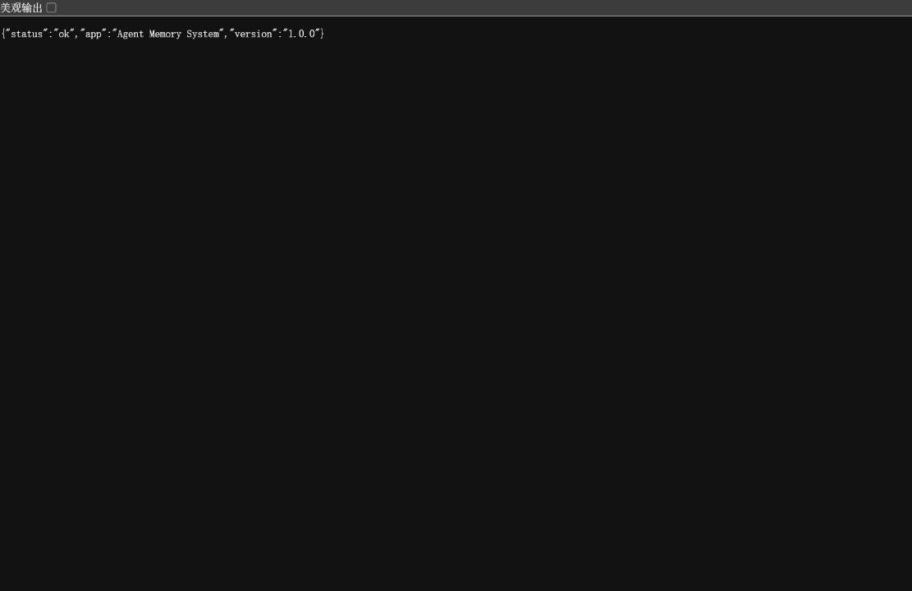
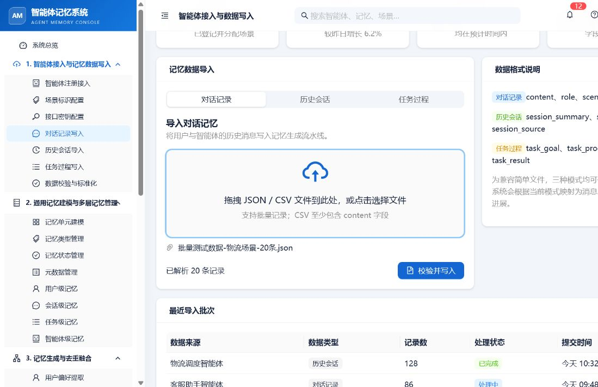
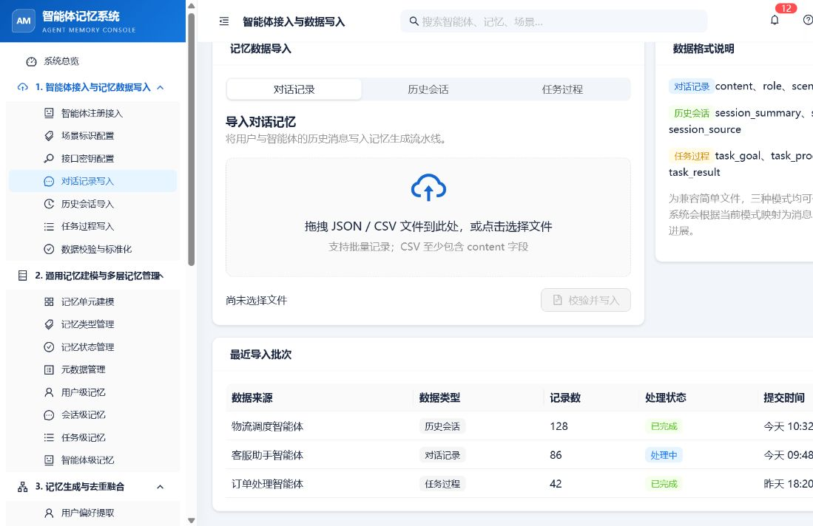
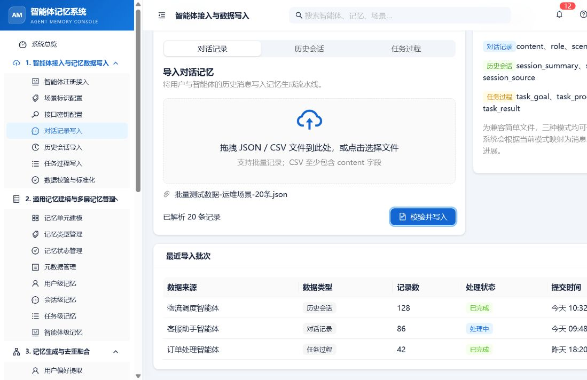
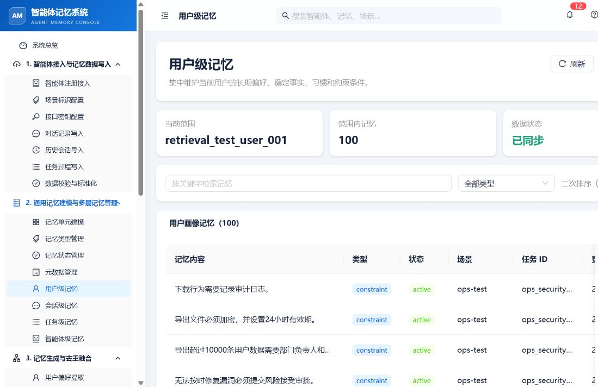
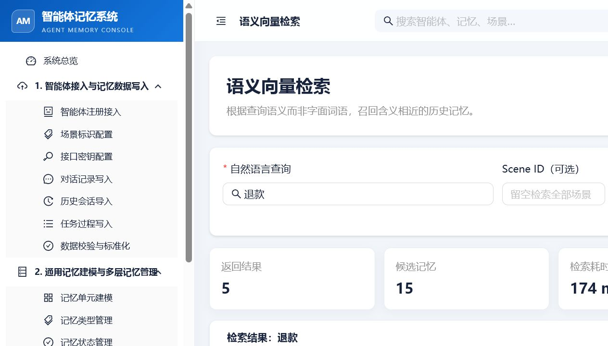
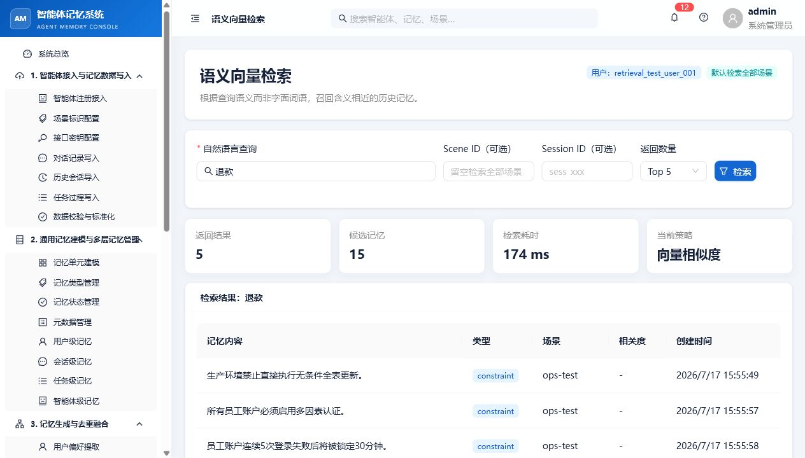
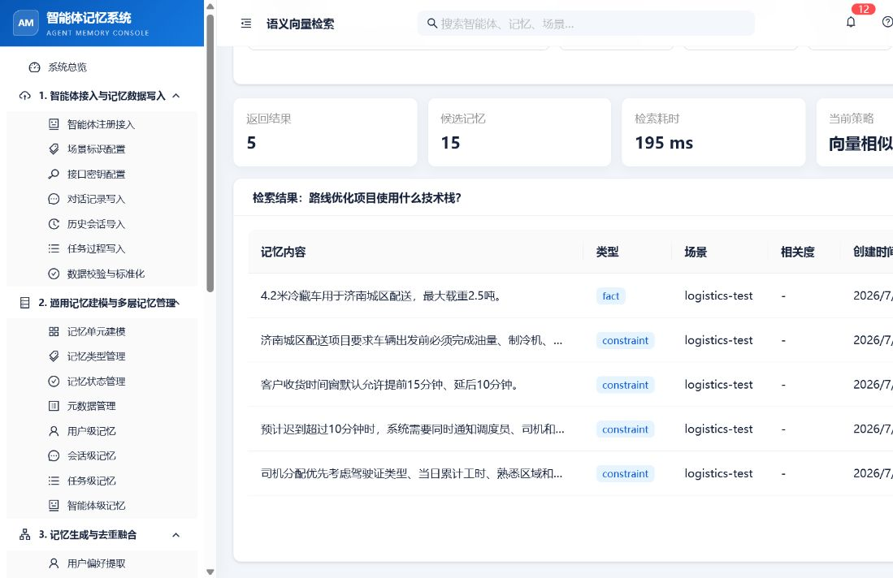

# 智能体记忆系统批量记忆检索测试结果记录（第二轮）

## 一、基本信息

| 项目 | 内容 |
| --- | --- |
| 测试日期 | 2026-07-17 |
| 测试后端 | http://120.27.207.238:8000 |
| 测试用户 | retrieval_test_user_001 |
| 原始导入数据 | 3 个场景文件，共 60 条记录 |
| 检索问题 | 批量检索测试问题-24题.json，共 24 题 |
| 测试方式 | 前端导入与检索 + 命令行 API 检索 |
| 清理状态 | 未执行清理，数据保留给人工复核 |

本轮使用全新的测试用户状态开始，测试前通过列表接口确认该用户没有历史记忆。测试结束后没有调用清除记忆接口。

## 二、后端健康检查

访问 /health 返回：

~~~json
{"status":"ok","app":"Agent Memory System","version":"1.0.0"}
~~~

结论：后端服务可正常连接。

## 三、完整数据导入过程

### 3.1 前端导入过程

前端页面：http://localhost:5173/ingestion?mode=dialogue  
当前用户：retrieval_test_user_001

三个文件分别上传，没有同时选择多个文件。每个文件先确认“已解析 20 条记录”，再点击“校验并写入”。

| 批次 | 前端解析 | 前端写入状态 | 本批最终记忆数 | 截图 |
| --- | ---: | --- | ---: | --- |
| 物流场景 | 20 条 | 完成，页面恢复为未选择文件 | 38 | 01、02 |
| 客服场景 | 20 条 | 完成，页面恢复为未选择文件 | 52 | 03、04 |
| 运维场景 | 20 条 | 前 10 条成功，处理第 11 条时进入异常分支 | 20（异常时） | 05、06 |

运维批次异常的判断依据：

1. 前端按钮停止加载后，已选择的运维文件仍然保留，页面没有回到“尚未选择文件”状态，符合前端异常分支的表现。
2. 异常时接口列表显示：ops_incident_001 有 8 条、ops_release_002 有 12 条，ops_database_003 和 ops_security_004 均为 0，说明前 10 条已处理，第 11 条数据库记录开始没有继续。
3. 没有重复提交整批运维文件，后续只补录缺失的第 11 至第 20 条。

### 3.2 运维缺失记录补录

通过命令行 API 只补录运维文件第 11 至第 20 条，未重提前 10 条：

| 范围 | 处理条数 | HTTP 200 | 生成记忆数 | 结果 |
| --- | ---: | ---: | ---: | --- |
| ops_database_003，第 11 至 15 条 | 5 | 5 | 12 | 全部成功 |
| ops_security_004，第 16 至 20 条 | 5 | 5 | 14 | 全部成功 |
| 合计 | 10 | 10 | 26 | 全部成功 |

### 3.3 导入后的记忆数量核对

等待约 10 秒使后端完成抽取、合并和索引后，按场景查询得到：

| 场景 | 记忆数 |
| --- | ---: |
| logistics-test | 38 |
| customer-service-test | 52 |
| ops-test | 46 |
| 合计 | 136 |

原始记录数与最终记忆数不需要相等，后端会从一条输入中抽取多个记忆单元，并对相近内容进行合并或跳过。

注意：前端“用户级记忆”页面显示当前页 100 条，而 API 返回 total=136、当前页 items=100。人工复核时应以 API 的 total 或分页合计为准。

## 四、24 道无筛选语义检索

请求方式：POST /api/v1/memory/search  
请求参数仅包含 user_id、query、top_k=5、rerank=false，不传 scene_id、task_id。

### 4.1 共同异常现象

- 24/24 请求 HTTP 200，code=0。
- 24/24 返回 5 条结果，total_candidates=15。
- 24/24 的 Top1 都是同一条记忆：生产环境禁止直接执行无条件全表更新。
- Top1 的 scene_id 都是 ops-test，task_id 都是 ops_database_003。
- 原始 API 返回的 relevance_score 全部为 null；前端相关度列显示为 “-”。
- 24 道题 expected_keywords 命中数全部为 0，严格标准通过数为 0。
- 平均耗时 170.6 ms，范围 137–357 ms。

| 编号 | Top1 场景/任务 | 场景/任务是否正确 | 返回数 | 候选数 | 关键词命中 | 耗时 | 结果 |
| --- | --- | --- | ---: | ---: | ---: | ---: | --- |
| Q01 | ops-test / ops_database_003 | 错 / 错 | 5 | 15 | 0 | 357 ms | 失败 |
| Q02 | ops-test / ops_database_003 | 错 / 错 | 5 | 15 | 0 | 219 ms | 失败 |
| Q03 | ops-test / ops_database_003 | 错 / 错 | 5 | 15 | 0 | 170 ms | 失败 |
| Q04 | ops-test / ops_database_003 | 错 / 错 | 5 | 15 | 0 | 183 ms | 失败 |
| Q05 | ops-test / ops_database_003 | 错 / 错 | 5 | 15 | 0 | 162 ms | 失败 |
| Q06 | ops-test / ops_database_003 | 错 / 错 | 5 | 15 | 0 | 199 ms | 失败 |
| Q07 | ops-test / ops_database_003 | 错 / 错 | 5 | 15 | 0 | 153 ms | 失败 |
| Q08 | ops-test / ops_database_003 | 错 / 错 | 5 | 15 | 0 | 162 ms | 失败 |
| Q09 | ops-test / ops_database_003 | 错 / 错 | 5 | 15 | 0 | 160 ms | 失败 |
| Q10 | ops-test / ops_database_003 | 错 / 错 | 5 | 15 | 0 | 143 ms | 失败 |
| Q11 | ops-test / ops_database_003 | 错 / 错 | 5 | 15 | 0 | 142 ms | 失败 |
| Q12 | ops-test / ops_database_003 | 错 / 错 | 5 | 15 | 0 | 145 ms | 失败 |
| Q13 | ops-test / ops_database_003 | 错 / 错 | 5 | 15 | 0 | 137 ms | 失败 |
| Q14 | ops-test / ops_database_003 | 错 / 错 | 5 | 15 | 0 | 152 ms | 失败 |
| Q15 | ops-test / ops_database_003 | 错 / 错 | 5 | 15 | 0 | 165 ms | 失败 |
| Q16 | ops-test / ops_database_003 | 错 / 错 | 5 | 15 | 0 | 183 ms | 失败 |
| Q17 | ops-test / ops_database_003 | 对 / 错 | 5 | 15 | 0 | 156 ms | 失败 |
| Q18 | ops-test / ops_database_003 | 对 / 错 | 5 | 15 | 0 | 152 ms | 失败 |
| Q19 | ops-test / ops_database_003 | 对 / 错 | 5 | 15 | 0 | 157 ms | 失败 |
| Q20 | ops-test / ops_database_003 | 对 / 错 | 5 | 15 | 0 | 147 ms | 失败 |
| Q21 | ops-test / ops_database_003 | 对 / 对 | 5 | 15 | 0 | 147 ms | 失败 |
| Q22 | ops-test / ops_database_003 | 对 / 对 | 5 | 15 | 0 | 147 ms | 失败 |
| Q23 | ops-test / ops_database_003 | 对 / 错 | 5 | 15 | 0 | 194 ms | 失败 |
| Q24 | ops-test / ops_database_003 | 对 / 错 | 5 | 15 | 0 | 162 ms | 失败 |

前端复现“退款”查询时，页面显示返回 5 条、候选 15 条，5 条全部来自 ops-test，相关度均显示 “-”。

## 五、带场景和任务过滤的第二轮检索

每道题增加 expected_scene_id 和 expected_task_id，其他参数保持不变。

### 5.1 统计结果

- 24/24 请求 HTTP 200，code=0。
- 24/24 的结果全部来自指定 scene_id 和 task_id，foreign scene/task 均为 0。
- 按 expected_keywords 和 expected_min_hits 自动检查，14/24 达标，10/24 未达标。
- relevance_score 仍全部为 null。
- 平均耗时 192.9 ms，范围 159–344 ms。

### 5.2 逐题结果

| 编号 | 任务 | 返回数 | 候选数 | 关键词命中/要求 | 耗时 | 场景/任务 | 结果 |
| --- | --- | ---: | ---: | --- | ---: | --- | --- |
| Q01 | log_route_001 | 5 | 13 | 4 / 1 | 344 ms | 对 / 对 | 通过 |
| Q02 | log_route_001 | 5 | 13 | 4 / 2 | 285 ms | 对 / 对 | 通过 |
| Q03 | log_route_001 | 5 | 13 | 0 / 1 | 193 ms | 对 / 对 | 失败 |
| Q04 | log_warehouse_002 | 5 | 10 | 2 / 2 | 218 ms | 对 / 对 | 通过 |
| Q05 | log_delivery_003 | 5 | 10 | 4 / 1 | 159 ms | 对 / 对 | 通过 |
| Q06 | log_delivery_003 | 5 | 10 | 2 / 1 | 167 ms | 对 / 对 | 通过 |
| Q07 | log_compliance_004 | 5 | 5 | 3 / 1 | 164 ms | 对 / 对 | 通过 |
| Q08 | log_compliance_004 | 5 | 5 | 6 / 2 | 162 ms | 对 / 对 | 通过 |
| Q09 | cs_refund_001 | 5 | 12 | 0 / 1 | 216 ms | 对 / 对 | 失败 |
| Q10 | cs_refund_001 | 5 | 12 | 0 / 2 | 160 ms | 对 / 对 | 失败 |
| Q11 | cs_delivery_002 | 5 | 14 | 3 / 1 | 168 ms | 对 / 对 | 通过 |
| Q12 | cs_delivery_002 | 5 | 14 | 0 / 1 | 188 ms | 对 / 对 | 失败 |
| Q13 | cs_membership_003 | 5 | 11 | 0 / 1 | 199 ms | 对 / 对 | 失败 |
| Q14 | cs_membership_003 | 5 | 11 | 3 / 2 | 169 ms | 对 / 对 | 通过 |
| Q15 | cs_complaint_004 | 5 | 15 | 0 / 1 | 185 ms | 对 / 对 | 失败 |
| Q16 | cs_complaint_004 | 5 | 15 | 0 / 2 | 174 ms | 对 / 对 | 失败 |
| Q17 | ops_incident_001 | 5 | 8 | 3 / 1 | 186 ms | 对 / 对 | 通过 |
| Q18 | ops_incident_001 | 5 | 8 | 4 / 2 | 178 ms | 对 / 对 | 通过 |
| Q19 | ops_release_002 | 5 | 12 | 0 / 1 | 162 ms | 对 / 对 | 失败 |
| Q20 | ops_release_002 | 5 | 12 | 3 / 3 | 182 ms | 对 / 对 | 通过 |
| Q21 | ops_database_003 | 5 | 12 | 4 / 1 | 164 ms | 对 / 对 | 通过 |
| Q22 | ops_database_003 | 5 | 12 | 5 / 2 | 159 ms | 对 / 对 | 通过 |
| Q23 | ops_security_004 | 5 | 14 | 0 / 1 | 266 ms | 对 / 对 | 失败 |
| Q24 | ops_security_004 | 5 | 14 | 0 / 2 | 182 ms | 对 / 对 | 失败 |

前端页面目前只有 Scene ID 和 Session ID 输入框，没有 Task ID 输入框，因此任务过滤结果通过 API 验证；前端场景过滤截图如下：

## 六、问题定位

### 6.1 主要问题：无筛选语义检索没有体现 query 对排序的影响

本轮比对后，问题表现更加明确：

1. 无筛选时 24 个完全不同的问题都返回同一批 Top5，Top1 固定为 ops_database_003。
2. 在指定同一个任务后，不同问题也经常返回完全相同的 Top3。例如 Q01/Q02/Q03 都返回路线任务相同的前三条，Q21/Q22 都返回数据库任务相同的前三条，Q23/Q24 都返回安全任务相同的前三条。
3. 过滤条件能够正确缩小候选范围，但候选范围内的排序仍像是固定顺序，而不是按 query 的语义相似度排序。
4. API 原始字段 relevance_score 为 null，前端只能显示 “-”，无法判断实际相似度排序是否发生。

优先检查后端以下位置：

- query embedding 是否真正使用了请求中的 query，是否出现空字符串、固定向量或异常降级。
- 向量库检索是否传入了 query 向量，limit/top_k 是否正确。
- 检索结果是否在候选合并后按相似度降序排序，而不是按创建时间、数据库返回顺序或固定 importance 排序。
- rerank=false 的路径是否绕过了实际排序逻辑。
- 返回结果序列化时是否丢失了 distance/score，导致 relevance_score 统一为 null。

建议临时增加后端调试字段或日志：query 摘要、query embedding 维度/哈希、向量库返回 score、过滤前后候选数、最终排序依据。这样可以直接确认是“查询向量没有变化”“向量库没有按分数返回”，还是“返回前被固定排序覆盖”。

### 6.2 前后端能力不一致

后端 API 支持 task_id 过滤且本轮验证 24/24 正确，但前端语义检索页面没有 Task ID 输入项，当前无法仅通过前端完整复现任务过滤流程。

### 6.3 前端批量导入缺少可恢复进度

前端按顺序逐条调用写入接口，运维第 11 条异常后停止后续记录，页面只保留文件和解析结果，没有提供“从第几条继续”的恢复按钮，也没有稳定展示已成功条数和失败记录详情。本轮通过 API 单独补录 10 条才完成数据集准备。

建议增加每条记录的成功/失败状态、失败记录导出、显式重试单条和断点续传；写入超时后重试前要先核对是否已经落库，避免重复写入。

### 6.4 前端记忆数量口径需要核对

API 返回 total=136、当前页 items=100，前端用户级记忆页显示“范围内记忆 100”。这可能是页面当前只展示 100 条，也可能是总数使用了当前页长度，应明确区分“总记忆数”和“当前页数量”。

### 6.5 非阻断前端警告

浏览器控制台出现 Ant Design 静态 message 不能消费动态主题上下文的 warning。本轮不影响页面加载、导入和检索，但建议后续统一使用 App 上下文中的 message。

## 七、人工复测方法

### 7.1 前端页面方式

1. 启动前端并打开 http://localhost:5173。
2. 进入“系统设置”，确认：
   - Base URL：http://120.27.207.238:8000
   - User ID：retrieval_test_user_001
3. 进入“用户级记忆”，点击刷新。当前数据已经保留，不要点击“清除记忆”。
4. 进入“语义向量检索”，设置 Top 5，保持 Scene ID 和 Session ID 为空，输入“退款”，点击检索。
5. 预期可观察到本轮同样的异常：返回 5 条、候选 15 条、结果主要来自 ops-test，相关度显示 “-”。
6. 再输入“路线优化项目使用什么技术栈？”，Scene ID 填 logistics-test，再次检索。预期结果全部来自 logistics-test，但排序内容仍可能偏向配送约束，而不是技术栈。
7. 前端没有 Task ID 输入框，因此任务过滤需要用下面的 API 方法复测。

### 7.2 命令行 API 方式（PowerShell）

先确认健康状态：

~~~powershell
$base = "http://120.27.207.238:8000"
Invoke-RestMethod -Method Get -Uri "$base/health"
~~~

查看当前测试用户的总记忆数：

~~~powershell
$user = "retrieval_test_user_001"
Invoke-RestMethod -Method Post -Uri "$base/api/v1/memory/list?user_id=$user&page=1&page_size=100"
~~~

复测无筛选语义检索：

~~~powershell
$body = @{
  user_id = "retrieval_test_user_001"
  query = "退款"
  top_k = 5
  rerank = $false
} | ConvertTo-Json

Invoke-RestMethod -Method Post -Uri "$base/api/v1/memory/search" -ContentType "application/json" -Body $body
~~~

重点查看返回 JSON 中的 results、total_candidates、scene_id、task_id、content 和 relevance_score。按本轮结果，Top1 预期为 ops-test / ops_database_003，relevance_score 预期为 null。

复测带场景和任务过滤：

~~~powershell
$body = @{
  user_id = "retrieval_test_user_001"
  query = "数据库备份保留多久？"
  scene_id = "ops-test"
  task_id = "ops_database_003"
  top_k = 5
  rerank = $false
} | ConvertTo-Json

Invoke-RestMethod -Method Post -Uri "$base/api/v1/memory/search" -ContentType "application/json" -Body $body
~~~

预期：5 条结果全部为 ops-test / ops_database_003，并出现“全量备份、90 天、增量备份、30 天”等内容。

复测另一个能直接看出 query 是否影响排序的对照组：

~~~powershell
$queries = @(
  @{ query = "数据库备份保留多久？"; task_id = "ops_database_003" },
  @{ query = "数据库灾备的 RPO 和 RTO 是多少？"; task_id = "ops_database_003" },
  @{ query = "API 密钥多久轮换一次？"; task_id = "ops_security_004" },
  @{ query = "大批量用户数据导出需要哪些审批？"; task_id = "ops_security_004" }
)

foreach ($item in $queries) {
  $body = @{
    user_id = "retrieval_test_user_001"
    query = $item.query
    scene_id = "ops-test"
    task_id = $item.task_id
    top_k = 5
    rerank = $false
  } | ConvertTo-Json

  $result = Invoke-RestMethod -Method Post -Uri "$base/api/v1/memory/search" -ContentType "application/json" -Body $body

  [PSCustomObject]@{
    Query = $item.query
    Task = $item.task_id
    Top1 = $result.data.results[0].content
    Score = $result.data.results[0].relevance_score
    Count = $result.data.results.Count
  }
}
~~~

请重点比较同一 task_id 下不同 query 的 Top1、Top3 和 relevance_score。如果结果顺序完全不变且分数为空，就可以复现本轮“过滤有效、语义排序未生效”的现象。

## 八、测试结论

后端服务和基本记忆写入、列表、元数据过滤功能可用；本轮 60 条原始数据已经完整准备并保留。核心缺陷仍在无筛选语义检索及过滤候选集内的排序：query 改变没有带来有效的结果变化，且 score 没有返回。请先由后端核查 query embedding、向量检索、排序和 score 序列化链路，再进行下一轮回归。

本轮没有删除测试数据，等待人工复测。
