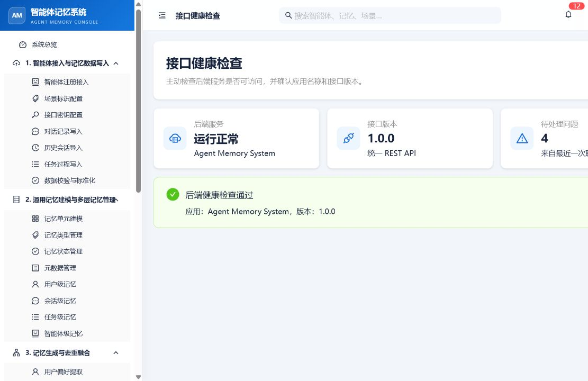
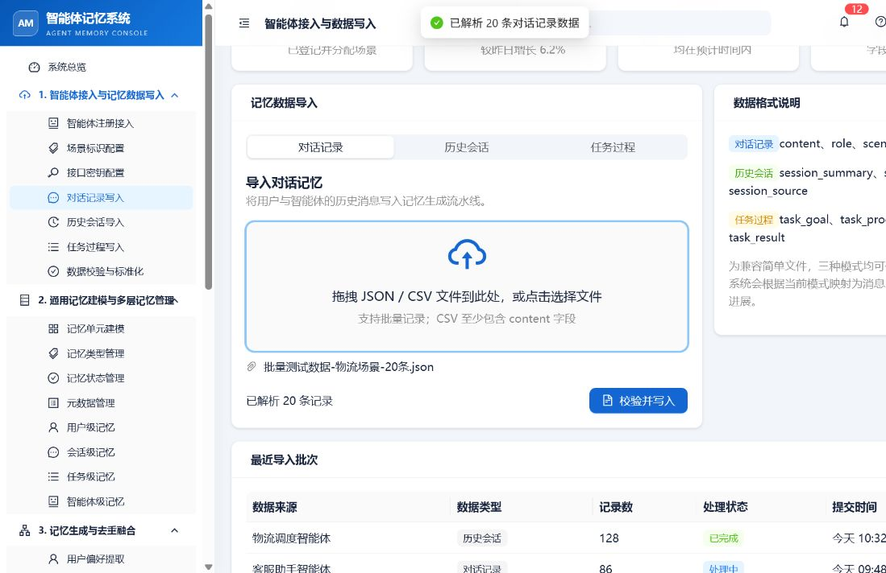

# 智能体记忆系统批量记忆检索测试结果记录

## 一、测试基本信息

| 项目 | 内容 |
| --- | --- |
| 测试日期 | 2026-07-17 |
| 后端地址 | http://120.27.207.238:8000 |
| 测试用户 | retrieval_test_user_001 |
| 前端地址 | http://localhost:5173 |
| 原始输入记录数 | 60 条 |
| 测试方式 | 后端 API 批量联调 + 前端页面冒烟验证 |
| 测试结论 | 后端联通、数据导入和元数据过滤通过；无筛选语义检索未通过 |

## 二、后端健康检查

访问 http://120.27.207.238:8000/health，返回：

    {"status":"ok","app":"Agent Memory System","version":"1.0.0"}

前端“接口健康检查”页面也显示：

- 后端服务：运行正常
- 应用：Agent Memory System
- 版本：1.0.0
- 健康巡检提示：后端服务连接正常

## 三、三批数据导入结果

三个 JSON 文件均按流程分开处理。除客服场景第 18 条在确认未落库后单独恢复一次外，其余记录均只提交一次；整个过程中没有重复提交整批数据。

| 场景 | 原始记录 | 成功处理 | 后端生成记忆 | 最终列表记忆 |
| --- | ---: | ---: | ---: | ---: |
| 物流 logistics-test | 20 | 20 | 43 | 40 |
| 客服 customer-service-test | 20 | 20 | 56 | 54 |
| 运维 ops-test | 20 | 20 | 52 | 43 |
| 合计 | 60 | 60 | 151 | 137 |

最终列表数量少于生成结果数量，符合后端合并、去重或跳过重复记忆的行为。

前端导入页验证了物流文件能够解析为 20 条对话记录；本次没有再次点击“校验并写入”，避免与已经完成的后端导入重复。

## 四、记忆保存与快速检查

导入完成并等待索引稳定后，用户级记忆列表显示 137 条记忆，场景分布如下：

- logistics-test：40 条
- customer-service-test：54 条
- ops-test：43 条

使用 Top-K=5、未指定场景和任务时进行快速检查：

| 查询词 | 返回数量 | 返回场景 | 结果判断 |
| --- | ---: | --- | --- |
| 冷链 | 5 | 全部为 ops-test | 未命中物流记忆 |
| 退款 | 5 | 全部为 ops-test | 未命中客服记忆 |
| P1 故障 | 5 | 全部为 ops-test | 场景相同，但任务多数不匹配 |

## 五、24 道检索问题记录

以下为第一轮检索结果：不设置 Scene ID 和 Task ID，Top-K=5。是否命中按测试流程的核心事实标准判断；仅场景或任务字段相同但没有核心事实命中的，仍记录为失败。

| 编号 | 问题类型 | 是否命中 | 命中排名 | 场景正确 | 任务正确 | 结果数 | 耗时(ms) | 结果等级 | 截图编号 | 备注 |
| --- | --- | --- | --- | --- | --- | ---: | ---: | --- | --- | --- |
| Q01 | 短问题-简单 | 否 | 未命中 | 否 | 否 | 5 | 226 | 失败 | — | Top1 为 ops-test / ops_database_003 |
| Q02 | 长问题-复杂 | 否 | 未命中 | 否 | 否 | 5 | 108 | 失败 | — | Top1 为 ops-test / ops_database_003 |
| Q03 | 短问题-简单 | 否 | 未命中 | 否 | 否 | 5 | 96 | 失败 | — | Top1 为 ops-test / ops_database_003 |
| Q04 | 长问题-复杂 | 否 | 未命中 | 否 | 否 | 5 | 108 | 失败 | — | Top1 为 ops-test / ops_database_003 |
| Q05 | 短问题-简单 | 否 | 未命中 | 否 | 否 | 5 | 94 | 失败 | — | Top1 为 ops-test / ops_database_003 |
| Q06 | 长问题-复杂 | 否 | 未命中 | 否 | 否 | 5 | 106 | 失败 | — | Top1 为 ops-test / ops_database_003 |
| Q07 | 短问题-简单 | 否 | 未命中 | 否 | 否 | 5 | 124 | 失败 | — | Top1 为 ops-test / ops_database_003 |
| Q08 | 长问题-复杂 | 否 | 未命中 | 否 | 否 | 5 | 98 | 失败 | — | Top1 为 ops-test / ops_database_003 |
| Q09 | 短问题-简单 | 否 | 未命中 | 否 | 否 | 5 | 108 | 失败 | — | Top1 为 ops-test / ops_database_003 |
| Q10 | 长问题-复杂 | 否 | 未命中 | 否 | 否 | 5 | 96 | 失败 | — | Top1 为 ops-test / ops_database_003 |
| Q11 | 短问题-简单 | 否 | 未命中 | 否 | 否 | 5 | 134 | 失败 | — | Top1 为 ops-test / ops_database_003 |
| Q12 | 长问题-复杂 | 否 | 未命中 | 否 | 否 | 5 | 91 | 失败 | — | Top1 为 ops-test / ops_database_003 |
| Q13 | 短问题-简单 | 否 | 未命中 | 否 | 否 | 5 | 125 | 失败 | — | Top1 为 ops-test / ops_database_003 |
| Q14 | 长问题-复杂 | 否 | 未命中 | 否 | 否 | 5 | 93 | 失败 | — | Top1 为 ops-test / ops_database_003 |
| Q15 | 短问题-简单 | 否 | 未命中 | 否 | 否 | 5 | 93 | 失败 | — | Top1 为 ops-test / ops_database_003 |
| Q16 | 长问题-复杂 | 否 | 未命中 | 否 | 否 | 5 | 95 | 失败 | — | Top1 为 ops-test / ops_database_003 |
| Q17 | 短问题-简单 | 否 | 未命中 | 是 | 否 | 5 | 102 | 失败 | — | 场景正确，但任务和核心事实不正确 |
| Q18 | 长问题-复杂 | 否 | 未命中 | 是 | 否 | 5 | 89 | 失败 | — | 场景正确，但任务和核心事实不正确 |
| Q19 | 短问题-简单 | 否 | 未命中 | 是 | 否 | 5 | 104 | 失败 | — | 场景正确，但任务和核心事实不正确 |
| Q20 | 长问题-复杂 | 否 | 未命中 | 是 | 否 | 5 | 92 | 失败 | — | 场景正确，但任务和核心事实不正确 |
| Q21 | 短问题-简单 | 否 | 未命中 | 是 | 是 | 5 | 110 | 失败 | — | 场景和任务正确，但没有命中预期事实 |
| Q22 | 长问题-复杂 | 否 | 未命中 | 是 | 是 | 5 | 90 | 失败 | — | 场景和任务正确，但没有命中预期事实 |
| Q23 | 短问题-简单 | 否 | 未命中 | 是 | 否 | 5 | 93 | 失败 | — | 场景正确，但任务和核心事实不正确 |
| Q24 | 长问题-复杂 | 否 | 未命中 | 是 | 否 | 5 | 86 | 失败 | — | 场景正确，但任务和核心事实不正确 |

第一轮统计：

- 通过数量：0
- 基本通过数量：0
- 失败数量：24
- 平均检索耗时：106.7 ms
- 所有题目返回的候选数量：15
- 所有题目的返回结果中 relevance_score 均为 null

## 六、第二轮场景和任务过滤验证

第二轮通过 API 为每道题增加 expected_scene_id 和 expected_task_id。当前前端语义检索页只有 Scene ID 和 Session ID 输入框，没有 Task ID 输入框，因此任务过滤能力使用后端 API 单独验证。

- 24/24 题返回 5 条结果。
- 24/24 题返回结果全部属于预期 Scene ID。
- 24/24 题返回结果全部属于预期 Task ID。
- 达到关键词和 expected_min_hits 自动标准的题目：Q01、Q02、Q05、Q07、Q20、Q21，共 6 题。
- 其余 18 题验证了过滤正确，但返回内容没有满足本次自动关键词命中标准。
- 过滤轮平均耗时为 654.6 ms；其中 Q22 为 8836 ms，Q24 为 4470 ms。排除这两个异常慢请求后平均耗时为 109.3 ms。

## 七、前端页面验证

| 页面/流程 | 结果 | 说明 |
| --- | --- | --- |
| 系统设置 | 通过 | Base URL 保存为后端地址，User ID 保存为 retrieval_test_user_001 |
| 接口健康检查 | 通过 | 页面显示后端运行正常、版本 1.0.0 |
| 对话记录写入 | 通过 | 物流 JSON 成功解析 20 条 |
| 用户级记忆 | 通过 | 成功加载记忆，并显示内容、类型、状态、场景、任务 ID、更新时间 |
| 语义向量检索 | 页面交互通过，结果验收失败 | 查询“退款”、Top-K=5 后返回 5 条运维记忆 |
| 前端任务过滤 | 未覆盖 | 语义检索页没有 Task ID 控件 |

本地前端基线检查：

- pnpm test：3 个测试文件、10 个测试用例通过
- pnpm build：通过
- pnpm lint：通过
- 构建仍有既有的单个大 chunk 警告，不影响本次功能验证

## 八、问题定位与建议

### 1. 主要问题：无筛选语义检索召回和排序异常

证据：

- “冷链”“退款”“P1 故障”等不同查询，在 Top-K=5 时都返回同一组运维数据库/安全记忆。
- Q01-Q16 的预期场景是物流或客服，但结果全部偏向 ops-test。
- 返回结果的 relevance_score 全部为 null，前端只能显示 “-”。
- 指定 Scene ID 和 Task ID 后，过滤结果正确，说明记忆写入和元数据保存基本正常，问题集中在无筛选的语义召回、排序或结果映射链路。

建议后端重点检查：

1. 查询文本是否正确生成 embedding，尤其是中文查询。
2. 向量索引召回是否真正使用 query embedding，而不是固定候选或错误缓存。
3. Top-K 截断和排序是否在过滤前后使用了错误的候选集合。
4. relevance_score 是否在响应序列化时丢失。
5. 为 Q01、Q09、Q17 建立后端回归测试，确保不同场景查询不会返回同一组无关结果。

### 2. 前后端能力不一致

后端 API 支持 task_id 过滤，但前端语义检索页面没有 Task ID 输入项，当前只能通过 API 验证任务过滤，无法完整复现流程中要求的第二轮前端操作。

### 3. 写入接口稳定性问题

客服场景第 18 条写入时出现连接被服务器关闭。虽然单条恢复成功，但建议后端增加幂等键、请求超时处理和明确的成功提交状态，避免前端无法判断“请求失败但数据已经落库”的情况。

### 4. 前端非阻塞警告

浏览器控制台出现 Ant Design 静态 message 使用 context 的 warning。它没有阻断本次流程，但后续可以将全局提示迁移到 App/Message API，消除控制台告警。

## 九、测试结束清理

已执行：

    POST /api/v1/memory/delete-all?user_id=retrieval_test_user_001

接口返回成功删除 151 条记忆；随后重新查询列表，剩余记忆数量为 0。未清理其他用户数据。

## 十、最终结论

本次测试可以证明：

- 后端当前可以正常联通。
- 三个场景的 60 条数据可以完成导入。
- 记忆列表、场景过滤和任务过滤接口可以工作。
- 前端设置、导入解析、记忆列表和健康巡检页面可以工作。

本次测试不能证明无筛选语义检索可用。按照测试模板的内容命中标准，第一轮 Q01-Q24 全部失败；当前主要阻塞是后端无筛选语义召回/排序异常，建议后端修复并回归验证后再进行正式验收。
