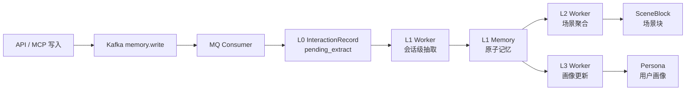

# 各层 Worker 工作说明

## 1. 总体数据流

系统的异步记忆处理链路如下：



各层采用数据库状态和游标推进，不依赖单次请求保持处理状态。服务重启后，worker 会根据数据库中的未处理数据和游标继续处理。

## 2. MQ Consumer：消息落地层

严格来说，MQ Consumer 不是 L0 Worker，但它是异步链路的入口。

### 主要职责

- 订阅 Kafka 的 `memory.write` topic。
- 批量拉取消息，单次最多处理 50 条。
- 将一条消息拆分为多条 `InteractionRecord`，写入 L0 表。
- 新写入记录的状态为 `pending_extract`，等待 L1 Worker 抽取。
- 使用 `record_id` 唯一约束和 `ON CONFLICT DO NOTHING` 实现幂等落库。
- 成功落库后手动提交 Kafka offset。

### 失败处理

- 单条消息最多重试 3 次。
- 重试采用指数退避，默认退避时间为 1 秒、2 秒、4 秒。
- 多次失败后写入 DLQ，并提交原消息 offset，避免阻塞后续消息。

### 与时间调度的关系

MQ Consumer 不受 L1 抽取时间窗口控制。即使 L1 当前处于关闭时段，消息仍然可以写入 L0；这些记录会保持 `pending_extract`，等 L1 窗口开启后处理。

## 3. L1 Worker：对话抽取层

代码位置：`app/services/l1_worker.py`

### 主要职责

L1 Worker 从 L0 增量记录中提取有价值的原子记忆，例如偏好、事实、任务状态和重要信息。

处理粒度是：

```text
(user_id, agent_id, session_id)
```

同一个会话的多条 L0 记录会被合并后交给记忆流水线处理。

### 工作流程

1. 每 5 秒扫描一次状态为 `pending_extract` 的 L0 记录。
2. 找出有待处理数据的用户、智能体和会话分组。
3. 为每个分组读取对应的 `MemoryCursor`。
4. 查询游标之后的 L0 增量记录。
5. 最多查询 20 条，实际每批处理 10 条。
6. 拼接对话文本并调用 `memory_pipeline.run()`。
7. 成功后：
   - 写入 L1 原子记忆。
   - 推进该会话游标。
   - 将已处理的 L0 标记为 `processed`。
8. 如果查询结果达到 20 条，认为仍有积压，立即继续处理，不等待下一次 5 秒轮询。
9. 最多同时处理 25 个会话分组。

### 游标

L1 使用以下格式作为游标键：

```text
user_id:agent_id:session_id
```

游标记录最后成功处理的 L0 自增 ID。只有记忆流水线成功并完成数据库提交后才推进游标，因此失败时会重新处理同一批数据，不会静默丢失。

### 时间窗口

L1 支持配置：

- 是否启用时间窗口。
- 开始时间。
- 结束时间。
- 时区。

例如：

```text
启用：true
时区：Asia/Shanghai
开始：23:00
结束：06:00
```

表示每天 23:00 至次日 06:00 前允许抽取。结束时刻采用左闭右开规则，即 `06:00` 已经停止。

worker 每次开始新一轮前都会重新判断窗口，因此 API 修改设置后通常会在最多 5 秒内生效。正在执行的当前批次不会被强制中断。

## 4. L2 Worker：场景聚合层

代码位置：`app/services/l2_worker.py`

### 主要职责

L2 Worker 将 L1 原子记忆按场景聚合为更完整的场景块 `SceneBlock`，形成有主题、有叙事的长期上下文。

处理粒度是：

```text
(scene_id, user_id)
```

同一个用户在同一个场景下的记忆会被统一聚合，不区分 agent。

### 工作流程

1. 每 10 秒扫描 active 状态的 L1 记忆。
2. 找出有记忆的 `(scene_id, user_id)` 分组。
3. 读取该分组的 L2 游标。
4. 查询游标之后最多 50 条新 L1 记忆。
5. 同时读取该场景已有的 `SceneBlock`。
6. 调用场景聚合逻辑生成新增、更新或删除操作。
7. 执行场景块变更。
8. 成功提交后推进 L2 游标。

### 游标

L2 使用以下格式作为游标键：

```text
l2:scene_id:user_id
```

游标记录最后处理的 L1 `seq_id`。只处理新产生的 L1 记忆，不会因为 L1 内容被更新而重复聚合历史数据。

### 失败处理

如果 LLM 聚合失败或处理异常，L2 不推进游标。下一次轮询仍会看到相同的 L1 增量并重试。

L2 没有单独的时间窗口，默认持续运行。它只会处理已经成功生成的 L1 记忆。

## 5. L3 Worker：用户画像层

代码位置：`app/services/l3_worker.py`

### 主要职责

L3 Worker 根据用户在场景中的新增 L1 记忆，生成或更新 `Persona` 用户画像。

处理粒度是：

```text
(scene_id, user_id)
```

### 工作流程

1. 每 15 秒扫描 active 状态的 L1 记忆分组。
2. 读取该用户和场景已有的 `Persona.last_seq_id`。
3. 统计 `seq_id > last_seq_id` 的新增 L1 记忆数量。
4. 默认累计达到 5 条新记忆时触发画像生成。
5. 调用 `generate_persona()` 生成或更新画像。
6. 由画像生成逻辑更新画像内容和处理游标。

### 触发条件

默认参数：

```text
轮询间隔：15 秒
触发阈值：5 条新 L1 记忆
```

因此 L3 不是每产生一条 L1 记忆就立即运行，而是按场景累计到阈值后批量更新画像。

### 失败处理

画像生成失败时记录失败指标，不会把失败当作成功处理。下一次轮询仍会根据未推进的画像游标重新判断是否达到触发阈值。

L3 没有单独的时间窗口，默认持续运行。

## 6. Worker 启动和停止

FastAPI 启动时会创建以下后台任务：

```text
MQ Consumer（Kafka 可用时启动）
L1 Worker
L2 Worker
L3 Worker
```

FastAPI 关闭时会设置各 worker 的 `stop_event`，worker 在当前轮询或当前批次结束后退出。

当前 Docker 启动命令使用单个 Uvicorn worker：

```text
uvicorn app.main:app --host 0.0.0.0 --port 8000 --workers 1
```

这样可以避免多个 Web 进程重复启动同一组后台 worker。

## 7. 延迟预期

异步链路不是实时同步调用，各层具有独立的轮询周期：

| 层级 | 默认周期 | 主要延迟来源 |
| --- | ---: | --- |
| MQ Consumer | Kafka 拉取超时约 1 秒 | Kafka、数据库写入、重试 |
| L1 Worker | 5 秒 | 时间窗口、LLM 抽取、批处理 |
| L2 Worker | 10 秒 | L1 完成时间、LLM 聚合 |
| L3 Worker | 15 秒 | L1 数量阈值、画像生成 |

在没有积压和外部服务延迟的情况下，单条消息从进入 Kafka 到完成 L1 通常需要数秒到几十秒；L2 和 L3 还会在此基础上继续等待各自的轮询周期和触发条件。

## 8. 典型状态变化

```text
Kafka message
  -> L0 InteractionRecord(status=pending_extract)
  -> L1 完成后 InteractionRecord(status=processed)
  -> Memory(status=active)
  -> L2 SceneBlock 更新
  -> L3 Persona 达到阈值后更新
```

排查异步链路时建议按这个顺序检查：

1. Kafka 是否收到并提交消息。
2. L0 是否生成 `pending_extract` 记录。
3. L1 日志是否出现 `L1 抽取完成`。
4. L1 `Memory` 是否为 `active`。
5. L2 日志是否出现 `L2 聚合完成`。
6. L3 是否已达到 5 条新增记忆的触发阈值。
